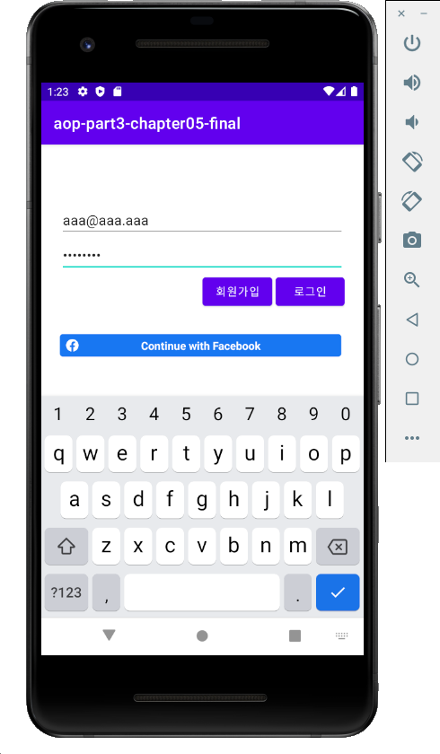
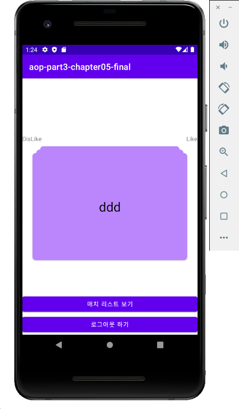

# aop-part3-chapter05 -  틴더

# 목차

1. 인트로 (완성앱 & 구현 기능 소개)
2. Firebase 환경설정하기
3. 이메일 로그인 구현하기
4. Facebook 환경설정하기
5. Facebook 로그인 구현하기
6. Firebase Realtime Database 연동하기
7. Swipe Animation 라이브러리 사용해보기
8. Like DB 연동하기
9. Match 된 유저목록 보여주기
10. 어떤 것을 추가로 개발할 수 있을까?
11. 마무리

# 결과화면

# 이 챕터를 통해 배우는 것

- **Firebase Authenetication** 사용하기

  - Email Login
  - Facebook Login

- **Firebase Realtime Database** 사용하기

- yuyakaido/CardStackView 사용하기

  

### 틴더

Firebase Authentication 을 통해 이메일 로그인과 페이스북 로그인을 할 수 있음.

Firebase Realtime Database 를 이용하여 기록을 저장하고, 불러올 수 있음.

Github에서 Opensource Library 를 찾아 사용할 수 있음.

